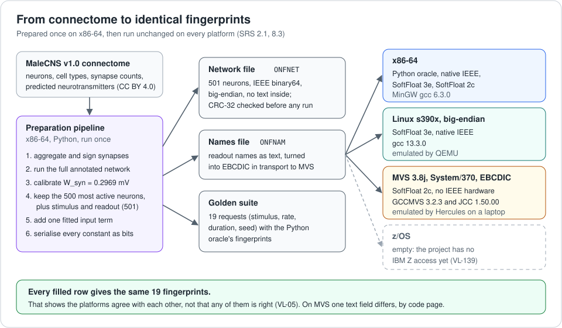
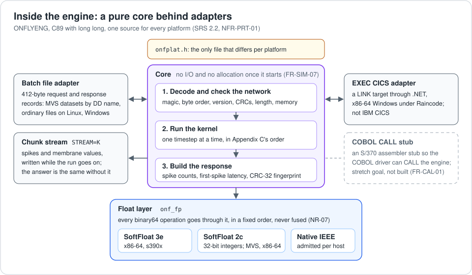
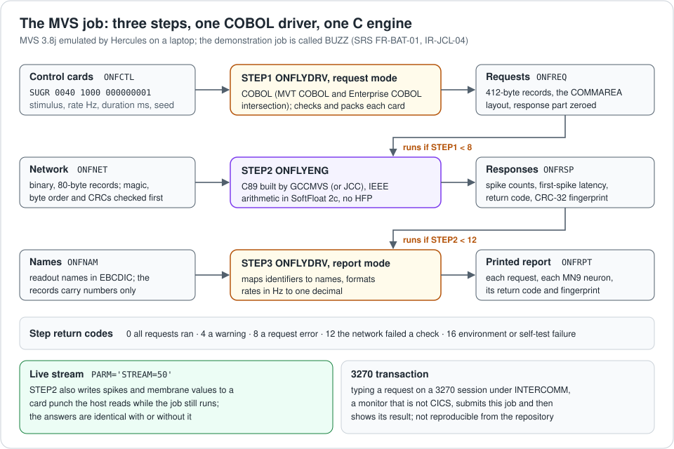
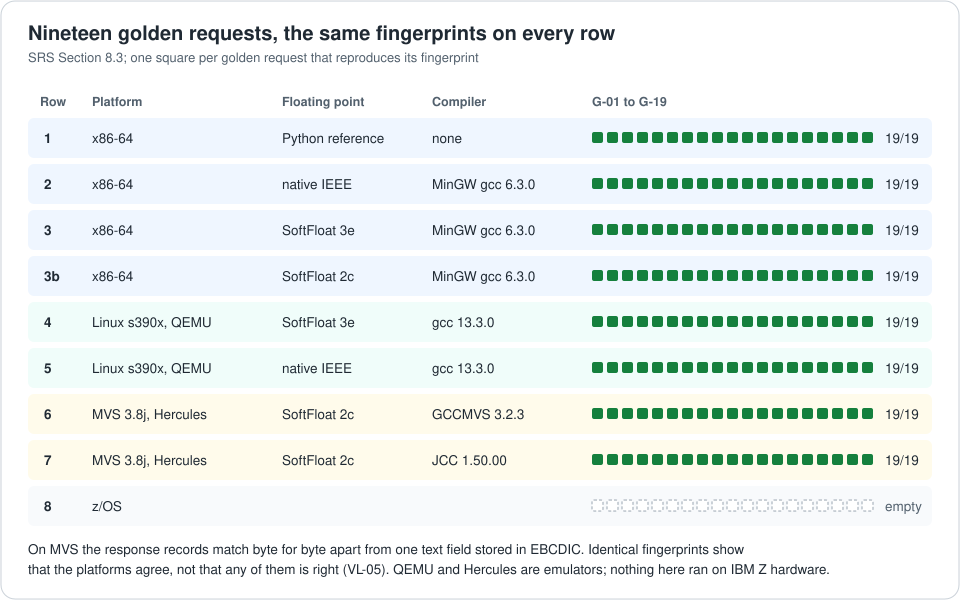

# How FlyBatch works

FlyBatch, called ONFLY until 2026-09-27, answers one kind of question: if
this fly tastes sugar at a given rate for a given time, what do its feeding
motor neurons do? This page explains how the answer is computed and how the
same answer is obtained, bit for bit, on three very different platforms. Every
statement here comes from the specification, `docs/ONFLY-SRS.md`, and the IDs
in brackets point to the rows that define or evidence it.

FlyBatch has not run on IBM Z hardware, and the project does not have IBM Z
access yet (VL-139). The MVS and s390x platforms below are emulated.

## The request and the answer

A request carries a stimulus code (`SUGR`), a rate in Hz, a duration in
milliseconds and a random seed. The answer carries, for each readout neuron,
its spike count and the time of its first spike in whole microseconds, a
return code, and a fingerprint: a CRC-32 of the answer's numbers
(IR-COM-05). The readout neurons are the two MN9 feeding motor neurons, and
the stimulus reaches 14 sugar-sensing neurons of the types PhG9 and
dorsal_tpGRN (D-52).

Request and answer share one 412-byte record layout, defined once and
generated as a COBOL copybook, a C header and a Python struct, so the three
languages cannot drift apart (IR-COM-01).

## From connectome to network file

Everything that needs a floating-point constant is computed once, on
x86-64, by the Python preparation pipeline under `prep/` (FR-PRP-06):

1. MaleCNS v1.0's synapses are counted per neuron pair and signed by the
   presynaptic neuron's predicted neurotransmitter (FR-PRP-03).
2. The 184,099-neuron annotated network is simulated in full, on x86-64 with
   the native backend, across the calibration and validation rates
   (FR-PRP-04). It holds 39.0% of the dataset's synapses (VL-13).
3. One free parameter, the weight of one synapse, is calibrated against a
   reference curve from Shiu et al.'s published model: W_syn = 0.2969 mV
   (SR-CAL, D-211).
4. The 500 most active neurons, plus every stimulus and readout neuron, form
   the 501-neuron subcircuit (SR-EXT-01, SR-EXT-03). It keeps every
   connection among them with unchanged weights, 10,783 of them.
5. Because the subcircuit leaves most of the brain out, it carries one fitted
   input term: a table of per-neuron input, one row per sampled sugar rate,
   standing in for the drive the missing neurons supplied (SR-EXT-02, D-205).
6. The result is written as a network file: a 172-byte header and aligned
   sections, every integer big-endian, every real number an IEEE 754 binary64
   bit pattern, and no text at all (IR-NET-01, IR-NET-02).

No target platform ever converts decimal text into floating point: the
constants arrive as bits (NR-06). The engine checks the file before it trusts
it: magic number, byte order, format version, header CRC, length and payload
CRC, in that order, then the memory it will need (FR-LOD-02, FR-LOD-04).

## The engine

ONFLYENG is one C89 source for every platform; only a small platform header,
`engine/include/onfplat.h`, differs (NFR-PRT-01). Its core decodes the
network, runs the kernel and builds the answer, and it does no input or
output and allocates no memory once it has started (FR-SIM-07). Everything
that touches a file or a caller is an adapter: the batch adapter that reads
request records and writes response records, the chunk stream that reports
spikes while a run is in progress (IR-STM), and on x86-64 Windows an
`EXEC CICS` adapter that runs under Raincode's CICS-compatible runtime, which
is not IBM CICS (VL-117).

Every binary64 operation goes through one float layer, `onf_fp`, with three
backends (NR-01):

* **SoftFloat 3e**, Berkeley's software IEEE 754 library, on x86-64 and
  s390x (NR-02).
* **SoftFloat 2c**, an older release that needs only 32-bit integers. It is
  the one MVS uses, because GCCMVS cannot compile the 64-bit integer
  arithmetic that 3e needs (NR-03, A-05, VL-15).
* **Native IEEE hardware**, admitted on a host only after it passes the
  TestFloat vectors and matches the software backend on every golden
  request, with fused multiply-add and fast-math switched off (NR-09).

## One timestep

The model is a leaky integrate-and-fire neuron with an exponentially decaying
synaptic input, as in Shiu et al. (2024). Each neuron has a membrane value
`u` (relative to rest) and a synaptic value `g`. The timestep is 0.1 ms, a
spike reaches its targets 1.8 ms (18 steps) later, and a neuron that fires is
refractory for 2.2 ms (SR-MOD-01, SR-MOD-02). A step does exactly this, in
exactly this order (Appendix C, NR-07):

1. **Arrivals.** The input that has waited 18 steps is added to each
   neuron's `g`, and then that neuron's row of the fitted input table.
2. **Stimulus draws.** Each of the 14 sugar neurons fires with probability
   rate times 0.1 ms, decided from a 32-bit random number with integer
   arithmetic only: a xorshift32 generator seeded from the request, and a
   rejection rule that makes the draw exactly uniform (NR-12, NR-13).
3. **Integrate, detect, emit.** For every neuron that is not refractory,
   `u` becomes `P11 * u + P12 * g` and `g` becomes `P22 * g`, where the three
   coefficients were computed on x86-64 and shipped as bits. A `g` below a
   tiny threshold is set to exactly zero, so no platform ever does
   subnormal arithmetic (NR-08). A neuron whose `u` is above threshold, or a
   sugar neuron whose draw fired, spikes: `u` and `g` are reset, and its
   weights are added to its targets' delayed input, targets in ascending
   order.

Every addition and multiplication is correctly rounded binary64, evaluated
left to right, never reordered and never fused. That order is part of the
specification, which is why two platforms can agree to the last bit.

## The MVS job

On MVS 3.8j the work is a batch job of three steps (FR-BAT-01). The COBOL
driver, ONFLYDRV, turns 80-column control cards into request records; the
engine runs them against the network; the driver runs again to print a
report with each MN9 neuron's name, spikes, latency, rate in Hz and the
fingerprint. The driver is one COBOL source written in the part of the
language that both the 1970s MVT compiler and modern Enterprise COBOL accept,
checked here by the GnuCOBOL proxy, not by Enterprise COBOL (FR-BAT-03,
VL-02). Each step sets a return code, and a later step runs only when the
earlier one ended well enough (IR-JCL-04).

Under Hercules 4.9.1 on an Intel Core i7-13650HX laptop, one standard
1000 ms request on the shipped network used 161 s of emulated CPU, inside the
10-minute budget; that is one emulator measurement and says nothing about
IBM Z performance (VL-106, VL-04).

The same job can stream its spikes to the host while it runs, through a card
punch the host reads live, and for the five shipped-network golden requests
that stream is byte-identical to the x86-64 one once line endings are
normalised (VL-135, D-414). Comparing those streams line by line found a
GCCMVS code-generation fault that had turned every +0.0 in the MVS kernel
into a tiny subnormal, which no fingerprint had caught; it is worked around,
not fully characterised (D-420, VL-127).

## The determinism matrix

The golden suite is 19 requests: silence, the validation rates, the largest
seed and rate, the shortest and longest durations, seed zero, a reserved and
an unknown stimulus, an out-of-range rate, and five requests on the shipped
network that exercise its fitted input table (Section 8.4). Every row of the
matrix that has been run reproduces all 19 fingerprints (Section 8.3, ACC-5).
On MVS the response records are identical to the x86-64 ones byte for byte,
apart from one text field MVS stores in EBCDIC (TX-01, D-261).

## What this does not show

* **Agreement is not correctness.** Identical fingerprints show that the
  platforms agree with each other, not that any of them computes the right
  thing (VL-05). The reference each engine is compared with is the Python
  oracle, which follows Appendix C step by step (Section 8.2, O-1).
* **The science was measured on x86-64 only.** MVS and s390x show the same
  numbers come out, not the biology (Phase E record, D-348).
* **Agreement with Shiu et al. is in shape, not magnitude.** The model on
  MaleCNS rises with sugar in the same shape as the published model on
  FlyWire but fires more at low rates, and no single synaptic weight removes
  that gap (VL-112, VL-103).
* **Two acceptance criteria were changed after the results were seen:**
  ACC-3 no longer tests 10 Hz, and ACC-4 no longer tests magnitude (D-202,
  D-340, D-341).
* **The subcircuit is not a whole brain.** It is 501 neurons with one fitted
  input term, drawn from a network that holds 39.0% of MaleCNS's synapses
  (VL-13, D-205).
* **Emulators are emulators.** The s390x results come from QEMU, the MVS
  results from Hercules, both on one laptop; neither says anything about real
  IBM Z hardware (VL-01, VL-82, VL-139).

## Where each part lives

| Part | Path |
|---|---|
| The engine, ONFLYENG | `engine/src/`, `engine/include/` |
| The float layer and its backends | `softfloat/`, `third_party/` |
| The record layout and what is generated from it | `layout/`, `generated/` |
| The COBOL driver, ONFLYDRV | `cobol/` |
| The Python oracle | `oracle/onfly_oracle/` |
| The preparation pipeline | `prep/` |
| The `EXEC CICS` transaction | `cics/` |
| The tests, and the tools that run the labs | `tests/`, `tools/` |
| Recordings and measurements | `data/` |

The specification, `docs/ONFLY-SRS.md`, holds every requirement, every
decision with its alternatives (Appendix A) and every limit (Appendix D).
`REPLICATING.md` lists what you can re-run, and what each step proves.
